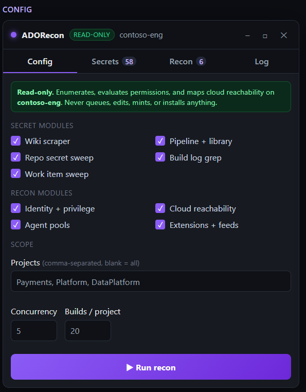
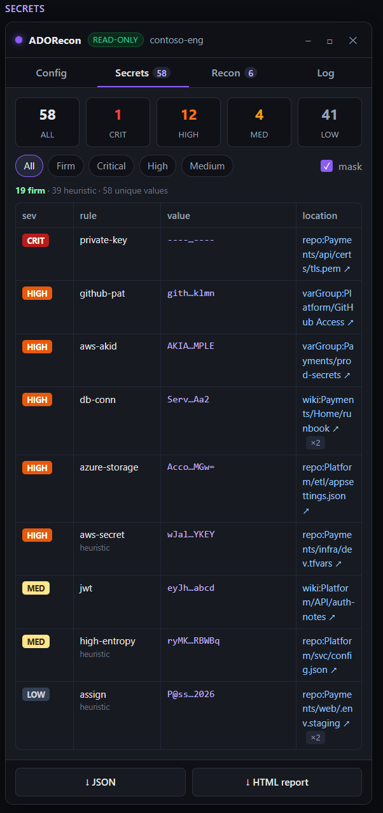
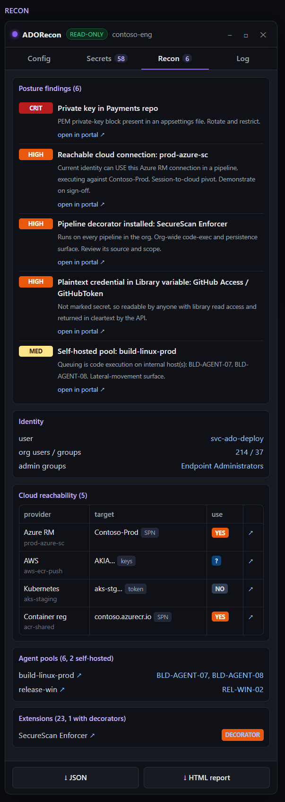
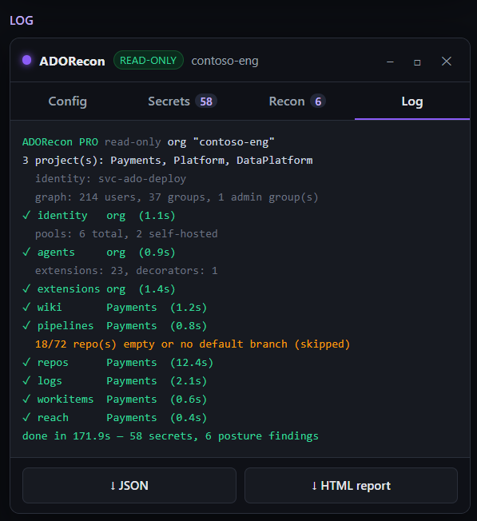

# ADORecon

Read-only Azure DevOps reconnaissance from the browser console. No PAT, no install, runs on the session you are already signed into.

Released by **Zer0byte**. Authorized security assessments only.

`READ-ONLY` · `NO PAT` · `ZERO INSTALL` · `SINGLE FILE`

---

## What it is

ADORecon is one JavaScript file you paste into the DevTools console on a tab that is already logged into Azure DevOps. It rides the live session cookies to enumerate the organization through the REST API, sweep for leaked secrets, and map which service connections and agent pools an operator with that foothold could reach.

It writes nothing. Every request is a `GET`, with a single exception that is hard-gated to two read-only query endpoints (WIQL and the permission-evaluation batch). There is no code path that queues a pipeline, mints a token, edits a definition, installs an extension, or pushes to a repo.

Findings render in a draggable, resizable in-page panel and export to JSON or a linked HTML report. Every finding deep-links to the exact resource in the portal.

## Screenshots

| Config | Secrets |
| --- | --- |
|  |  |

| Recon | Log |
| --- | --- |
|  |  |

> Open `sample-report.html` in a browser to view a sample exported report.

## Why session-based and read-only

Most Azure DevOps tooling asks for a Personal Access Token. ADORecon does not. It works from a foothold an operator already has: a browser signed into the target org. That means:

- Nothing to provision, store, or clean up. No PAT to leak.
- The tool sees exactly what the compromised or assessed identity sees, which is the realistic attacker view.
- Read-only by design, so it is safe to run inside an engagement window and easy to put in a rules-of-engagement document.

## Safety model

- The transport function only issues `GET`.
- One helper, `readQuery()`, is allowed to `POST`, and it is gated by an allow-list to the WIQL and permission-evaluation endpoints. Any other URL throws.
- The following are deliberately **not** implemented, because they change or execute against a live tenant. They belong in the report as "reachable, demonstrate on sign-off", not in an always-on tool:
  - queue or edit pipelines
  - mint a PAT
  - register a pipeline decorator or install an extension
  - create a service hook
  - change a group membership or ACL
  - push to a repository

The tool maps reachability to those techniques and writes them up as findings. It never exercises them.

## Usage

1. Sign into `https://dev.azure.com/<org>` (or `https://<org>.visualstudio.com`).
2. Open DevTools with F12, then the Console tab.
3. Paste the full contents of `adorecon-pro.js` and press Enter.
4. The panel drops into the top-right corner. Pick modules and scope on the Config tab, then press **Run recon**.
5. Browse the Secrets and Recon tabs. Export with **JSON** or **HTML report**.

The raw findings object is also available at `window.ADORecon.data`.

## Modules

**Secret modules**

- Wiki scraper: pulls every wiki page and scans the content.
- Pipeline and library: variable groups (reads plaintext non-secret values, lists secret-flagged names), secure files, service connections, and classic build-definition inline scripts.
- Repo secret sweep: walks each repo and scans high-signal files by default (`.env`, `web.config`, `appsettings*`, `.tfvars`, keys, YAML, scripts), or every file when asked.
- Build log grep: pulls recent completed build logs and greps for secrets that scripts printed past the masking.
- Work item sweep: queries recent work items per project and scans Title, Description, Repro Steps, and Discussion.

**Recon modules**

- Identity and privilege: resolves the authenticated identity and, where reachable, the org identity graph.
- Cloud reachability: classifies each service connection by provider and target (Azure subscription, AWS access key id, Kubernetes cluster, container registry), then uses the read-only permissions API to check whether the current identity can use it (the pivot) or administer it (over-privilege). Also flags repo-write as a supply-chain surface.
- Agent pools: enumerates pools and flags self-hosted ones, with agent hostnames where readable, as code-execution and lateral-movement surface.
- Extensions and feeds: lists installed extensions, flags pipeline decorators (an org-wide execution and persistence surface with a clean detection signature), and enumerates artifact feeds.

## Output and reporting

- **Secrets tab**: severity counts (All, Critical, High, Medium, Low), a Firm filter for high-confidence findings, text search, mask toggle, click-to-copy values, and resizable columns.
- **Recon tab**: posture findings first, then identity, cloud reachability, agent pools, and extensions.
- **HTML report**: a sectioned, light-theme deliverable with a summary band, jump-to navigation, and a deep link on every finding.
- **JSON**: the full raw structure for tooling.

## Detection tiers

Every secret rule is tagged `firm` or `heuristic`.

- **Firm** rules match fixed-format tokens (private keys, `AKIA...`, `ghp_...`, `github_pat_...`, Slack, Google, npm, Azure Storage/SAS, connection strings, structurally valid JWTs). Very low false-positive rate.
- **Heuristic** rules are entropy and format guesses (40-char AWS secret shapes, 52-char ADO PAT shapes, bearer values, credential-like assignments, quoted high-entropy strings). They are filterable and review-required.

Findings are de-duplicated globally, with per-source de-dup for marker rules like private keys so distinct files stay distinct. Rich-text fields (work items, wiki) have inline base64 images and HTML stripped before scanning, which removes a common class of false positive.

## Limitations

- Some enrichment (org identity graph, extensions, artifact feeds) lives on sibling hosts (`vssps`, `extmgmt`, `feeds`). On visualstudio.com-backed orgs those are cross-origin and answer with wildcard CORS, which the browser blocks for credentialed calls. Running from the org's `*.visualstudio.com` origin usually enables them.
- Large orgs with many repositories take longer, since the sweep walks each non-empty repo. Tune concurrency and the file cap on the Config tab.

## Companion tool: SPRecon

`sprecon.js` is the SharePoint Online and M365 sibling, same architecture and same read-only guarantees. It is search-driven: it uses the SharePoint Search API (scoped to what the account can see) to inventory sites, surface externally and anonymously shared content, flag broad-access grants and guest accounts, and sweep document content for secrets.

## Detection and response

Every posture finding ADORecon surfaces has a matching audit signature that a blue team can alert on. The tool only enumerates these; it never performs them.

| Finding | Detection signature (Azure DevOps audit / activity logs) |
| --- | --- |
| Reachable cloud connection | Service connection created or authorized; pipeline run that consumes it |
| Pipeline decorator installed | Extension install; contribution type `ms.azure-pipelines.pipeline-decorator` |
| Self-hosted agent pool | Agent pool or agent registration; off-hours job queue |
| Plaintext credential in Library variable | Variable group read; variable not flagged secret |
| Repo write reachable | Push events; branch policy or reviewer bypass |
| PAT minting (not performed by this tool) | Token creation events for the identity |

## Authorized use

This tool is for authorized security assessments only. Run it only against Azure DevOps organizations you own or are contracted to test. You are responsible for having permission. The authors accept no liability for misuse.

## License

See `LICENSE`.

## Author

Built and maintained by Zer0byte.
